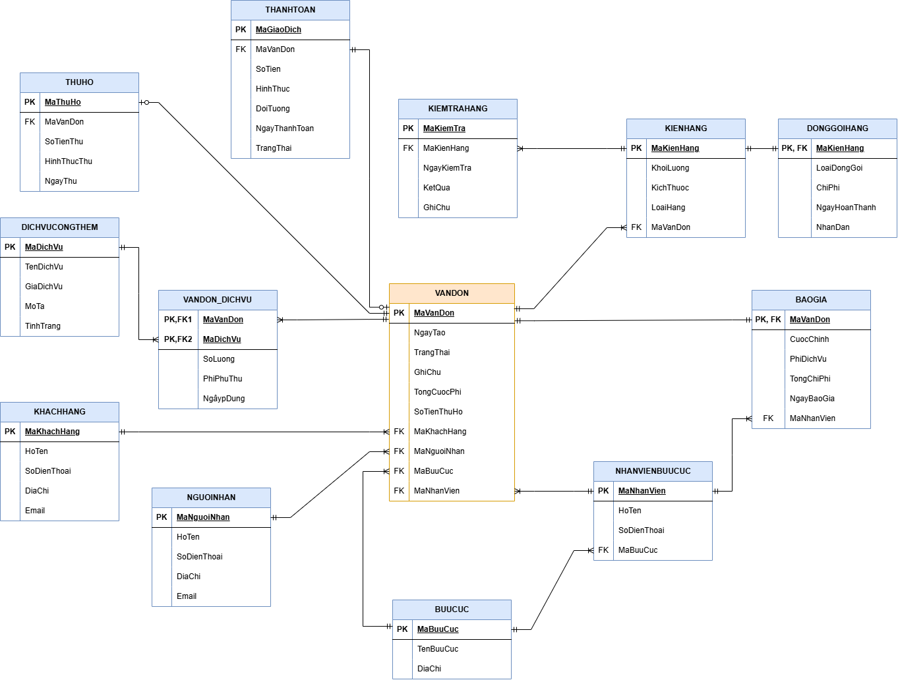

# Business Process Analysis and Redesign for Viettel Post

## Overview

This academic project focuses on analyzing and redesigning Viettel Post's logistics process to improve operational efficiency and support digital transformation.

## Responsibilities

- Analyzed the current (As-Is) business process and identified inefficiencies.
- Modeled As-Is and To-Be processes using BPMN.
- Proposed process improvements and automation solutions.
- Designed the database structure using ERD.
- Documented business processes and system requirements.

## Deliverables

### BPMN Process Models
- As-Is Process
- To-Be Process

### Entity Relationship Diagram



### Final Report
- Business Process Analysis
- Problem Identification
- Process Redesign
- System Documentation

## Tools

- BPMN
- Draw.io
- ERD
- AppSheet

## Repository Structure

```
business-process-analysis-viettel-post
│
├── BPMN AS-IS_TO-BE.pdf
├── ERD.png
├── FINAL REPORT.pdf
└── README.md
```

## Project Type

Academic Project – Business Process Analysis
